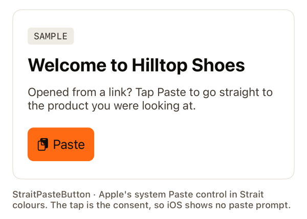
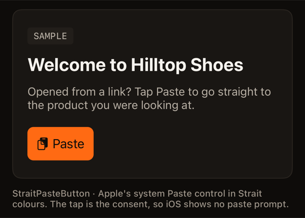

<!-- Header: the same in every Strait SDK README (design system v5). -->
<p align="center">
  <a href="https://straitlink.in">
    <picture>
      <source media="(prefers-color-scheme: dark)" srcset=".github/assets/strait-lockup-dark.svg">
      
    </picture>
  </a>
</p>

<h1 align="center">Strait SDK for iOS</h1>

<p align="center"><strong>Straight to the screen. On the record.</strong><br>
A tap opens the exact screen, and every link open and install is recorded in your Strait dashboard.</p>

<p align="center">
  <a href="https://github.com/bazingga08/strait-sdk-swift/tags"></a>
  <a href="https://straitlink.in/platform-status/"></a>
  <a href="https://straitlink.in/docs/iphone-install-matching/"></a>
  <a href="https://github.com/bazingga08/strait-sdk-swift/actions/workflows/ci.yml"></a>
  <a href="LICENSE"></a>
</p>

<p align="center">
  <a href="https://straitlink.in/docs/sdks/ios/">Docs</a> ·
  <a href="https://straitlink.in/platform-status/">Platform status</a> ·
  <a href="CHANGELOG.md">Changelog</a> ·
  <a href="#docs-and-support">Talk to the Strait team</a>
</p>

`StraitSDK` (iOS / Swift)

Deferred deep linking for native iOS: the user taps your link, installs, and
lands on the right screen. On iPhone, **you choose the method** in Dashboard →
Settings → iPhone installs: **device matching**, **paste handoff** (the
clipboard), both, or neither; device matching is off by default for new
workspaces. The SDK reads your choice from Strait on the first
launch, so changing it needs no app update. Navigating, not
tracking: the signals route one tap and are never used to build profiles. How it works and what it uses: [How iPhone install matching works](https://straitlink.in/docs/iphone-install-matching/).

Part of [Strait](https://straitlink.in). The match signature is a Swift port kept in lockstep with
the server and every other SDK via shared golden vectors
(run by `swift test` in CI). 32-bit hash overflow is matched with `Int32` + `&*`.

> ⚠️ Verified by CI (`swift test` on macOS) against the golden vectors and on the
> iOS simulator (Safari tap -> deferred match, custom scheme, paste button). Not yet
> proven on a real iPhone: the signable reference app and the scripted real-device
> proof are ready in [`Examples/StraitReference`](Examples/StraitReference/README.md).

## Platform features

| Feature | Status | Notes |
|---|---|---|
| Direct links: Universal Links and custom schemes | ◐ Beta | Not yet proven on a real iPhone. |
| iPhone install matching (deferred links) | ◐ Beta | Your choice in Dashboard → Settings → iPhone installs: device matching, paste handoff, both or neither, read from Strait at runtime. Device matching is off by default. iPhone matches are labelled Estimated until measured. |
| Paste button (`StraitPasteButton`, iOS 16+) | ◐ Beta | Apple's system Paste control in Strait colours; the tap is the consent, so no paste prompt. |
| Store sheet: the App Store inside your app | ◐ Beta | Keeps the deep link through the install. |
| Swift Package Manager | ● Live | From this repo's version tags. |

● Live · ◐ Beta · ○ Planned · – Not yet. The same words as the [platform status](https://straitlink.in/platform-status/) page.

## Install

Swift Package Manager:

<!-- brand:install -->
Xcode: **File → Add Package Dependencies…** and paste the repo URL, or in `Package.swift`:

```swift
.package(url: "https://github.com/bazingga08/strait-sdk-swift", from: "0.8.0")
// target dependency: .product(name: "StraitSDK", package: "strait-sdk-swift")
```
<!-- /brand:install -->

## Use — `StraitLinks` (direct + deferred links, analytics)

Create one client at launch and keep it for the app's lifetime.

```swift
import StraitSDK

let strait = StraitLinks(StraitLinksConfig(
    publishableKey: "st_pub_live_…",
    endpoint: "https://<your-handle>.strait.link",
    linkHosts: ["links.yourbrand.com"]   // extra short-link domains (custom domains, coming soon): URLs or bare hosts
))

strait.onLinkStart { start in showOpeningLink(start.id) }   // loading state
strait.onLink { event in                                    // replays past events
    guard event.matched, let path = event.path else { return }
    router.open(path, params: event.params ?? [:])
}
```

### UIKit with scenes (SceneDelegate)

```swift
func scene(_ scene: UIScene, willConnectTo session: UISceneSession, options: UIScene.ConnectionOptions) {
    // The link that launched the app from closed (Universal Link or custom scheme).
    let launchURL = options.userActivities.first(where: { $0.activityType == NSUserActivityTypeBrowsingWeb })?.webpageURL
        ?? options.urlContexts.first?.url
    strait.start(initialURL: launchURL)       // also runs the deferred check, once per install
}

func scene(_ scene: UIScene, continue userActivity: NSUserActivity) {
    strait.handle(userActivity: userActivity)  // Universal Link while running
}

func scene(_ scene: UIScene, openURLContexts URLContexts: Set<UIOpenURLContext>) {
    URLContexts.forEach { strait.handle(url: $0.url) }   // yourapp://… browser hand-off
}
```

Without scenes, do the same from `application(_:didFinishLaunchingWithOptions:)`
(`launchOptions?[.url]`), `application(_:continue:restorationHandler:)` and
`application(_:open:options:)`.

### SwiftUI

```swift
@main struct ShopApp: App {
    init() { strait.start() }
    var body: some Scene {
        WindowGroup {
            ContentView()
                .onOpenURL { strait.handle(url: $0) }
                .onContinueUserActivity(NSUserActivityTypeBrowsingWeb) { strait.handle(userActivity: $0) }
        }
    }
}
```

SwiftUI delivers the cold-launch URL through `onOpenURL` too, so it is labelled
by app state rather than `closed`; if you need `closed` (and the first-launch
deferred skip), adopt a `UIApplicationDelegateAdaptor`/scene delegate and pass
the launch URL to `start(initialURL:)`.

### What Strait records automatically (no extra code)

Every time a link opens the app, the SDK reports it once (contract B14):

| How the app opened | Reported via | Joined to |
|---|---|---|
| Universal Link tapped in WhatsApp, Gmail, Messages… | `/v1/resolve` (the lookup is the report) | the link; also counted as a tap |
| Browser handed off to the app (`yourapp://…`) | `/v1/open` | the exact tap (`strait_click`, removed before your app sees the URL) |
| First open after an App Store install | `/v1/match` | the matched tap |
| Your own https links | `/v1/open` | the URL's host + path (plus `utm_source`, for the channel); query and fragment never leave the device (B18) |

Reports that can't be sent (offline, server busy) are saved in `storage`
(`strait.pendingOpens`) and retried on the next `start`, whenever the app
becomes active, and after any report that gets through, for up to 7 days
(max 100). The engine de-duplicates by open id (`LinkEvent.id`), so nothing is
counted twice. Navigation never waits for a report. The first launch of an
install is marked as such, so dashboards can tell **new users** (installed and
opened) from **existing users** (already had the app). The deferred check is
only marked done once the server answered, so an offline first launch is
retried on the next launch.

```swift
strait.pendingOpenReports { count in }   // saved reports waiting to be sent (debugging)
strait.flushOpenReports { }              // send them now
```

### Lifecycle and storage

- `start` observes `UIApplication` didBecomeActive / willResignActive /
  didEnterBackground to label links `background` vs `foreground`. Set
  `observeLifecycle: false` and call `strait.onAppState(.active | .inactive | .background)`
  to feed it yourself. `stop()` removes the observers.
- The once-per-install flag `strait.deferredChecked` and the pending open
  reports `strait.pendingOpens` live in `UserDefaults.standard` by default;
  pass any `StraitStorage` to change that.
- `transport:` (a `StraitTransport`, default `URLSession.shared`), `now:` and
  `device:` are injectable for tests. Callbacks run on the main queue
  (`callbackQueue: nil` runs them on whatever thread finished the work).

### Analytics + fingerprint check

```swift
strait.trackEvent("purchase", value: 49.99, currency: "USD", linkId: event.linkId) { ok in }
// The event carries the tap id of the last attributed link open for 7 days, so
// revenue lands on that tap's channel / A/B variant (contracts B15/B16): a
// browser hand-off, or the engine's reply to a Universal Link or a deferred
// match. A newer open replaces the older tap. Pass `clickId:` to set it yourself.
strait.reportFingerprint { json in }   // POST /v1/debug/fingerprint, origin "app"
strait.compareFingerprint { json in }  // engine's app-vs-browser comparison
strait.checkDeferred { event in }      // re-run the deferred check (debugging)
```

### iPhone (beta): you choose the deferred-link method

Dashboard → Settings → **iPhone installs** has two switches. You make the choice,
and it applies at runtime: on the first launch the SDK asks Strait
(`POST /v1/match`, whose reply carries `ios: {deviceMatching, pasteHandoff}`) and
does what that reply says. Nothing is baked into your app build and the SDK never
stores the choice, so a change reaches apps already in the App Store on their
next first launch (within about 30 seconds), with no release.

| Device matching | Paste handoff | What happens on the first launch |
|---|---|---|
| off | off | No deferred link on iPhone. The install is still counted; the app opens on its home screen. |
| on | off | Device matching only. The clipboard is never touched. |
| off | on | Paste handoff only. If the clipboard holds your one-time link, the SDK claims it (iOS shows "Allow Paste"). |
| on | on | Device matching first. Only if it finds nothing does the SDK try the paste handoff. |

**New workspaces start with both off** (device matching off by default since
10 Oct 2026). Existing workspaces keep the values they had.

#### Device matching

The server compares the tap with the first launch using the IP address (stored
only as a keyed hash), its network block and provider, screen size, language,
time zone and iOS version. It is navigating, not tracking: the signals are used
only to open the right screen in your app, one tap gives at most one match, and
nothing is used for profiles or advertising. A tap can be matched for **1 hour**;
the server's nightly cleanup erases its signals once that hour is a day old, so
they are gone **within about 2 days of the tap** (at most 49 hours). Device
matching never touches the clipboard.

**Apple policy note:** Apple's rules say apps may not fingerprint devices, even
with tracking permission, and some App Review teams treat device matching as
fingerprinting. Whether to take that risk is your decision; paste handoff alone
avoids it. When device matching is off, Strait stores no device signals at the
tap and erases the ones already stored for the workspace. Android installs keep
using the Play Install Referrer either way.

#### Paste handoff (contract B19)

With paste handoff on, the "Get the app" button on your iPhone link page also
copies a one-time Strait link (`https://<your-handle>.strait.link/h/<token>`,
single use, 24 hours). No app code is needed beyond the usual setup:

```swift
let strait = StraitLinks(StraitLinksConfig(
    publishableKey: "st_pub_live_…",
    endpoint: "https://<your-handle>.strait.link"
))
```

On the first launch only, when Strait's reply says paste handoff is on and device
matching found nothing (or is off), the SDK asks iOS whether the clipboard
probably holds a web link (`UIPasteboard.detectPatterns`, **no prompt**). Only if
it does, it reads the clipboard, and **iOS shows its "Allow Paste" prompt** at
that moment. If the person allows it and the text is a Strait handoff link for
your link hosts, the SDK claims it (`POST /v1/handoff/claim`) and you get the
exact destination (`route: .clipboard`). Anything else (no link, another site's
link, a used or expired token, "Don't Allow") keeps the device match result. Both
attempts share one `openId`, so one install is one event. Only the token is ever
sent, never other clipboard text. If Strait can't be reached, the clipboard is
left alone and the whole check runs again on the next launch.

`clipboardBoost` in `StraitLinksConfig` is **deprecated and ignored**: the
dashboard switch decides. Existing code that sets it still compiles.

**No prompt at all:** show Apple's Paste button instead. iOS shows no prompt
because the person's tap is the consent (iOS 16+):

```swift
// UIKit
if #available(iOS 16.0, *) {
    let button = StraitPasteButton(straitLinks: strait)
    button.onResult = { event in /* event.matched, event.url */ }
    view.addSubview(button)
}

// SwiftUI
PasteButton(payloadType: URL.self) { urls in
    strait.claimHandoff(text: urls.first?.absoluteString)
}
```

`strait.handoffAvailable { likely in }` tells you (no prompt) whether a web link
is on the clipboard, so you can decide whether to show the button.

The Paste button works whatever the switches say: it claims whatever the person
pastes, whenever they tap it.

**How it looks.** `StraitPasteButton` draws Apple's Paste control in the Strait design
system (v5): the orange fill `#FF6A13` with ink text `#0F0D0A` (6.8:1, WCAG AA) in light and
dark, 8 pt corners, icon and label, and at least 44 pt tall. It has no animation of its own.
To match your app instead, pass a configuration:

```swift
let config = UIPasteControl.Configuration()
config.baseBackgroundColor = .label           // your colours
config.baseForegroundColor = .systemBackground
let button = StraitPasteButton(straitLinks: strait, configuration: config)
// StraitPasteButton.straitConfiguration() is the default
```

| Light | Dark |
|---|---|
|  |  |

### Design tokens

`StraitTokens` (generated from the Strait brand tokens v5, `Sources/StraitSDK/StraitTokens.swift`;
never edit it by hand) carries the semantic colours for light and dark, spacing, radii, type
sizes and durations. `StraitTokens.dynamic(\.brand)` gives a `UIColor` that follows the system
appearance; `StraitTokens.light.brand.color` a SwiftUI `Color`. Durations are seconds: use 0 when
`UIAccessibility.isReduceMotionEnabled`.

### Store sheet (beta; iPhone is beta)

When a user taps **Install** for one of your other apps (a sibling, partner or
"lite" app), show the App Store *inside your app* and keep the deep link for the
app being installed.

```swift
strait.openStoreSheet(
    url: "https://<handle>.strait.link/promo",
    options: StoreSheetOptions(style: .productPage), // or .overlay (SKOverlay, iOS 14+)
    presenter: SystemStoreSheetPresenter(from: viewController)
) { result in
    // result.opened, result.method ("product_page" | "overlay" | "none"), result.reason
}
```

What it does:

1. `POST /v1/store-sheet` records the tap (`sent_to = store_sheet`, not billed
   during the beta) and returns the App Store id and the link's campaign, sent
   as the `ct` campaign token.
2. Unless the workspace turned iPhone install matching off, it saves this
   device's match fields for that tap (`POST /v1/match-save`). The installed
   app's normal deferred check finds it. iPhone matching is beta.
3. With `copyHandoffLink: true` and the workspace's paste handoff on, it also
   copies the one-time handoff link; the installed app claims it for an exact
   match. Off by default, because it replaces what the
   user had copied.
4. It shows `SKStoreProductViewController` (the full product page as a sheet)
   or `SKOverlay`. Pass `providerToken` / `customProductPageId` if you use them.

It works only where your app is the host. A link tapped inside another
company's app can't open a store sheet there. Offline, pass `appStoreId` to
still show the store (the deep link is not kept then, `reason = "offline"`).

### Showing the live choice (settings or debug screens)

```swift
if let s = strait.lastInstallSettings {   // from the latest /v1/match reply, nil before one
    print(s.summary)                       // "Device matching only", "Paste handoff only", …
    print(s.deviceMatching, s.pasteHandoff)
}
strait.checkDeferred { _ in /* re-asks Strait (adds no installs); lastInstallSettings updates */ }
```

It is for display only: the SDK acts on each reply as it arrives and never stores
the choice. An engine older than the runtime-choice release sends no `ios` object,
so it stays nil.

### App Clip handoff (beta)

If your app ships an App Clip, a link on your link host can open the App Clip with
the exact URL. Save it in an App Group both targets share; the full app's first
launch takes it once and opens it, an exact deferred deep link with no device
matching and no clipboard:

```swift
// App Clip
.onContinueUserActivity(NSUserActivityTypeBrowsingWeb) { activity in
    if let url = activity.webpageURL, let group = StraitAppClip.storage(appGroup: "group.com.yourco.app") {
        StraitAppClip.saveInvocation(url, storage: group)
    }
}

// Full app, before start
let clipURL = StraitAppClip.storage(appGroup: "group.com.yourco.app")
    .flatMap { StraitAppClip.takeInvocation(storage: $0) }
strait.start(initialURL: clipURL)   // nil = the normal deferred check
```

Both targets need the same App Groups capability; the App Clip needs
`appclips:<your host>` in Associated Domains, and its bundle ID
(`<app bundle ID>.Clip`) saved in Dashboard → Settings → App configuration, so
your link host's `apple-app-site-association` lists it under `appclips`. A saved
link is usable for 7 days and handed over once.

### Real iPhone checklist (beta)

1. Xcode → Signing & Capabilities: your team; **Associated Domains** →
   `applinks:<handle>.strait.link`; your custom scheme under URL Types.
2. Dashboard → Settings → App configuration: the same Apple Team ID (10
   characters, Membership details on developer.apple.com) and bundle ID.
3. `curl -sD - https://<handle>.strait.link/.well-known/apple-app-site-association`
   answers `200`, `application/json`, no redirect, with `appIDs: ["TEAMID.bundle"]`.
   Apple's copy: `https://app-site-association.cdn-apple.com/a/v1/<handle>.strait.link`.
4. Install on the phone (Developer Mode on). Tap a link from Notes or Messages:
   a typed URL or a link on the same host never opens the app.
5. During development add `applinks:<host>?mode=developer` and turn on Settings →
   Developer → Associated Domains Development to skip Apple's CDN cache.

[`Examples/StraitReference`](Examples/StraitReference/README.md) does all of this
with one script (`scripts/set-team.sh TEAMID BUNDLE_PREFIX`) and proves it with an
XCUITest on a connected iPhone (`scripts/device-proof.sh`).

### `LinkEvent`

`id` · `kind` (`direct` / `deferred`) · `route` (`app_link`, `custom_scheme`,
`fingerprint`, `clipboard`) · `appState` (`closed`, `background`, `foreground`) · `matched` ·
`reason` (`not_found`, `expired`, `password_protected`, `no_match`, `network`,
`invalid_url`, `not_handoff`, `handoff_unknown`, `handoff_used`, `handoff_expired`) · `rawUrl` · `url` · `path` · `params` · `linkId` · `ms` · `at` · `referralCode` (deferred links only: the referral code the tap carried, when the engine sends one; referrals are a preview and not switched on yet, contract B21; grant rewards from your server via the `referral.converted` webhook).
`id` is the open id Strait records the open under (`o_<base36 ms>_<12 chars>`).
A `LinkStart` with the same `id` fires first, before any network call.

## Behaviours (shared-spec/SDK-CONTRACT.md)

| # | Status |
|---|---|
| B1 publishableKey in every body | ✓ (`/v1/match`, `/v1/resolve`, `/v1/open`, `/v1/event`, `/v1/debug/fingerprint`; GET compare sends it as a query param) |
| B2 `screenWidth = browserScreenWidth(UIScreen.main.bounds.width)` | ✓ |
| B3 short links on link hosts → `POST /v1/resolve {publishableKey,url,platform:'ios'}` | ✓ (hosts via `normalizeLinkHosts`) |
| B4 custom scheme / https classification (`classifyUrl`), `strait_click` removed (`takeClickId`) | ✓ |
| B5 app-state labels (`AppStateTracker`, 2000/1000 ms) | ✓ |
| B6 deferred once per install, skipped-but-marked when launched by a link; marked only once the engine answered | ✓ |
| B7 Android Play Install Referrer | n/a on iOS (`parseStraitLink` / `parseStraitClick` are ported for parity) |
| B8 iOS deferred `POST /v1/match` with device fields + `openId`, `at` | ✓ |
| B9 one event type, replay, start signal | ✓ |
| B10 never throws; network → `matched:false, reason:'network'` | ✓ |
| B11 JSON via `JSONSerialization` | ✓ |
| B12 `splitUrl` without `URLComponents` | ✓ |
| B13 `trackEvent`, `reportFingerprint`, `compareFingerprint` | ✓ |
| B14 every open reported once; offline reports queued and retried | ✓ (`pendingOpenReports`, `flushOpenReports`) |
| B15 conversion events carry the tap id of the last attributed open (7 days; `clickId:` overrides) | ✓ (`strait.lastTap`) |
| B16 every attributed open supplies the tap id (`/v1/resolve` and `/v1/match` reply `clickId`, `replyClickId`) | ✓ |
| B17 `screenWidth` is the portrait width: `portraitScreenWidth(bounds.width, bounds.height)` in any orientation | ✓ |
| B18 reported/queued URLs stripped to host + path (+ `utm_source`) via `reportUrl`; expired remembered taps deleted (`staleTap`) | ✓ |
| B19 paste handoff: chosen in the dashboard and read from the `/v1/match` reply (`ios.pasteHandoff`) at runtime; `clipboardBoost` deprecated, `detectPatterns` first (no prompt), read only when a URL is likely, `parseHandoffUrl`, `POST /v1/handoff/claim`, fallback to `/v1/match`; `claimHandoff(text:)` + `StraitPasteButton` | ✓ (B1–B6, B8–B19) |

Both `test-vectors.json` (signature) and `conformance-vectors.json` (pure
helpers) run under `swift test` in CI.

## Deferred match only (legacy, still supported)

```swift
let result = await Strait.resolveDeferredLink(
    StraitConfig(publishableKey: "st_pub_live_…", endpoint: "https://<your-handle>.strait.link")
)
if result.matched, let url = result.longUrl {
    // route to url
}
```

**Publishable key:** Dashboard → Get started → Publishable key (`st_pub_live_…`).
It's safe to include in your app. Never put your secret key (`st_live_…`) in an app.

Collects only coarse device fields (screen width, scale, language, timezone);
the **server** adds the observed IP and computes the match signature.

## Docs and support

- **Docs:** [straitlink.in/docs/sdks/ios/](https://straitlink.in/docs/sdks/ios/) · [platform status](https://straitlink.in/platform-status/) · [troubleshooting](https://straitlink.in/docs/troubleshooting/)
- **Talk to the Strait team:** [support@straitlink.in](mailto:support@straitlink.in) (replies within 1 working day, IST) or call +91 81218 61890.
- **Bugs and feature requests:** [open an issue](https://github.com/bazingga08/strait-sdk-swift/issues) on this repo.
- **Security:** never in a public issue. Write to security@straitlink.in (see [SECURITY.md](SECURITY.md)).
